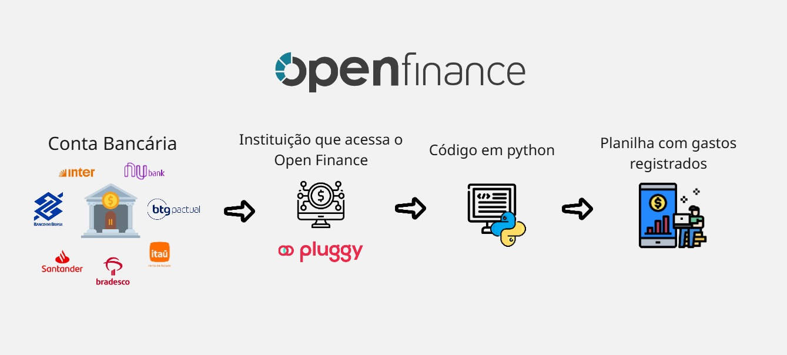

# automacao-financas-pessoais

## 🏦 Resumo (Open Finance para Google Sheets)
Este projeto tem o objetivo de **poupar o trabalho manual de preencher planilhas de gastos financeiros pessoais**. Basicamente funciona consumindo dados do Open Finance de uma conta bancária de uma pessoa física (via API da Pluggy) e organizando os dados em uma planilha no Google Sheets.

## Como Funciona?


## ✨ Funcionalidades
- **Sincronização de Tempo**: utiliza arquivos de log para identificar a data da última transação capturada, evitando registros duplicados
- **Categorização de Gastos**: registra o tipo de gasto (mais frequentes e conhecidos) com base no texto contido na descrição da transação
  - exemplo: se tiver "99" ou "uber" na descrição -> label = '🚗 Uber/99/inDrive' // se tiver "ifood" -> label = '🍔 Restaurante'
- **Detecção de Meio de Pagamento**: diferencia transações feitas via Pix, Cartão de Crédito ou Débito
- **Registro por Data**: Reconhece a data da transação e registra a transação no mês em que ocorreu (na minha planilha cada aba é um mês diferente)

## 🛠️ Teconologias Utilizadas
- **python 3.10+**
- [Pluggy API](https://www.pluggy.ai/): para conexão com instituições bancárias via Open Finance
    - Vídeo bem didático explicando como integrar com a Pluggy: https://youtu.be/PjJ0F8GIHTs
- [gspread](https://docs.gspread.org/en/v6.1.4/): biblioteca para integração com a API do Google Sheets
    - Vídeo bem didático explicando como integrar com a API do Google: https://youtu.be/zCEJurLGFRk
- **Logging**: para rastreio de erros e controle de execução

## ⚙️ Configuração e Instalação
1. **Requisitos Prévios**
Antes de rodar o script, você precisará de:
    - Uma conta na **Pluggy** para obter o ```client_id``` e ```client_secret```.
    - Uma **Service Account** no Google Cloud Console com acesso à API do Google Sheets.
2. **Arquivos de Credenciais**
O projeto espera dois arquivos na raiz (não incluídos no repositório por segurança):
    - ```credentials.json```: suas chaves do Google Cloud
    - ```.env```: demais credenciais necessárias (veja .env.example)
3. **Instalação**
Clone o repositório e instale as dependências:
git clone https://github.com/seu-usuario/nome-do-repositorio.git
cd nome-do-repositorio
pip install requests gspread google-auth

## 📌 Notas
- **Primeira Vez**: quando for usar o código pela primeira vez, configure as datas das transações em ```from_date``` e ```to_date``` (deixei comentado)
- **Fuso Horário**: o código realiza um ajuste de -3 horas para o horário de Brasília (as transações são registradas em GMT 0)
- **Categorias**: você pode personalizar suas próprias categorias dentro da função ```put_label``` no arquivo ```main.py``` (ex: classificar como mercado reconhecendo o nome do mercado (que você sempre vai) na descrição das transações
- **Funciona em 90% das transações**: muito provavelmente em virtude de políticas do Banco Central e dos próprios bancos, ou por ser relativamente uma tecnologia recente, algumas transações simplesmente não são registradas no Open Finance, eu diria que a cada 10 somente 1 não aparece. Mesmo assim vejo utilidade, visto que ao final do mês posso simplesmente bater olho no que está faltando e registrar, de qualquer forma, poupa bastante tempo.
- **Entendendo estrutura JSON**: no arquivo ```entendendo_json.json``` é possível rodar o código exclusivo de requisições para entender como as transações são estruturadas em JSON.

## ❓ Possíveis Dúvidas
- **Existe alguma vulnerabilidade ao conectar ao Open Finance?**
  - A integração com a Pluggy (via Meu Pluggy) foi feita exclusivamente para ler dados, não é possível fazer nada mais além disso.
- **A Pluggy é confiável?**
  - A Pluggy é uma das maiores plataformas de Open Finance do Brasil, processando milhões de transações mensalmente. Ela segue rigorosos padrões de segurança internacional (como o ISO 27001) e atua em conformidade com a LGPD (Lei Geral de Proteção de Dados). Além disso, a comunicação de dados é protegida por criptografia de ponta a ponta (AES-256).
- **Meus dados estão seguros durante o processo?**
  - Sim. Toda a comunicação entre o script, a API da Pluggy e o Google Sheets é feita através de protocolos HTTPS com criptografia TLS, garantindo que as informações trafeguem de forma segura e privada.
- **Preciso gastar com algo?**
  - Não, todo este projeto é viável sem gastar nada. O Meu Pluggy é a integração gratuita da Pluggy, e a quantidade de registros no Google Sheets é ínfima diante do que a API do Google permite de forma gratuita.